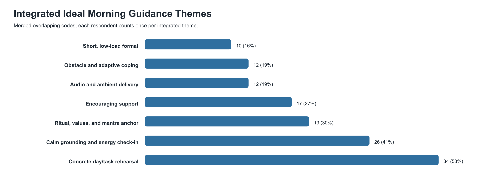

# Integrated Ideal Morning Guidance Thematic Analysis

Source: manual thematic coding of `idealMorningGuidance`. Usable responses: `64`.

Integration note: `Structured day planning` and `Task/success visualization` were merged because both describe concrete rehearsal of the day/task. `Morning ritual` and `Values/purpose` were also merged as anchoring context rather than separate product modules.

## Integrated Themes

### Concrete day/task rehearsal - 34/64 (53%)

A practical walkthrough of the day or main task: priorities, order, timing, successful completion, and next action.

Representative quotes:
- "I prefer clear prioritises and clear ideas of tasks to have a clear picture of the day. Some calm and quiet me time to think about my plan of action"
- "Something that acknowledges what might have happened in the night and then sets me up for the day step by step in a gentle warm and encouraging tone."
- "Something that starts with body/mind presence meditation and then works into specific tasks for the day, ending with overarching goal/mantra reminder."

### Calm grounding and energy check-in - 26/64 (41%)

A quiet start that uses breath, body awareness, meditation, current energy, or sensory grounding before action.

Representative quotes:
- "I prefer clear prioritises and clear ideas of tasks to have a clear picture of the day. Some calm and quiet me time to think about my plan of action"
- "Something that starts with body/mind presence meditation and then works into specific tasks for the day, ending with overarching goal/mantra reminder."
- "A visualisation of what I want to achieve. A run down of my energy and how I might feel. A structured step by step guide of how I can achieve what I want."

### Encouraging support - 17/64 (27%)

Warmth, reassurance, validation, confidence, motivation, and a supportive tone.

Representative quotes:
- "Something that acknowledges what might have happened in the night and then sets me up for the day step by step in a gentle warm and encouraging tone."
- "You are enough,  focused and very hard working. You make decisions that produces positive outcomes and that is enough for all the days."
- "Just something that tells me what to do regarding my schedule as well as a motivative sentence or phrase to get me through the day."

### Obstacle and adaptive coping - 12/64 (19%)

Preparing for disruptions, hard moments, low energy, and recovery moves.

Representative quotes:
- "Relaxing my self and  Identify what I need to do in this day, start with difficult tasks when I get tired I do easy tasks for the day."
- "Reflect on accomplishments, reflect on capabilities, review the day ahead, review the tasks, anticipate obstacles, relax the mind"
- "Laying out my tasks for the day. Ordering them in terms of priority. Allowing for disruptions and giving myself enough options."

### Audio and ambient delivery - 12/64 (19%)

Guided voice, spoken audio, music, nature sound, ambient background, or a calming physical setting.

Representative quotes:
- "Having to start the day with an audio message that reminds me of the activities I'm going to do, and then when I'm free being able to read that audio in writing."
- "My ideal mental rehearsal guidance to start the day would be a gentle voice telling me that everything will go well today"
- "Listening to someone speaking aloud so I can do it while I complete tasks and visualise myself following it"

### Short, low-load format - 10/64 (16%)

Short, simple, punchy, adjustable guidance that avoids feeling overwhelming.

Representative quotes:
- "Something short and punchy. You don't need to fill up a whole page with complicated phrasing. Just give me a sentence or two instead of a long paragraph."
- "A good script with some encouragement and brief steps on what to do for the day. Nothing too hectic and overwhelming"
- "Before i start my day, i want a short rehearsal that helps me focus on the most important work ahead."

### Ritual, values, and mantra anchor - 19/64 (30%)

Fitting rehearsal into prayer, meditation, exercise, coffee, reading, or closing with values, purpose, strengths, or a mantra.

Representative quotes:
- "Something that starts with body/mind presence meditation and then works into specific tasks for the day, ending with overarching goal/mantra reminder."
- "Reflect on accomplishments, reflect on capabilities, review the day ahead, review the tasks, anticipate obstacles, relax the mind"
- "A calm place and I would let my body just get used to the routine, I think it would make everything ok"

## Product Summary

People mainly want a short guided rehearsal that makes the day feel concrete and manageable. The script should not only visualize success; it should help users walk through priorities, timing, the first task, and likely friction.

Recommended default script arc:

1. Calm body/breath arrival.
2. Acknowledge current energy or the previous night.
3. Walk through priorities and schedule.
4. Rehearse one important task to a good-enough finish.
5. Name one obstacle and recovery move.
6. Close with encouragement plus one mantra/value/next action.
