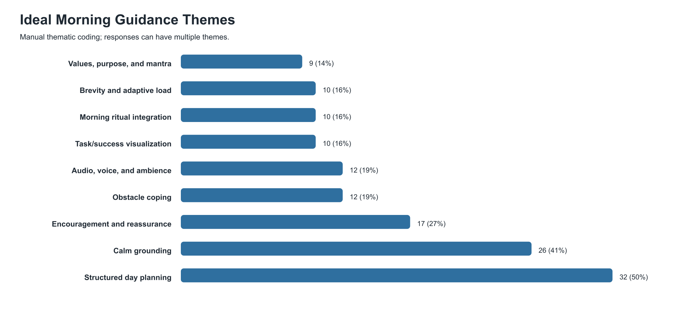

# Ideal Morning Guidance Thematic Analysis

Source: `idealMorningGuidance` from latest sheet export. Usable responses: `64`.

## Theme Summary

### Structured day planning - 32/64 (50%)

Users want a concrete plan for the day: tasks, priorities, order, timing, and next steps.

Representative quotes:
- "I prefer clear prioritises and clear ideas of tasks to have a clear picture of the day. Some calm and quiet me time to think about my plan of action"
- "Something that acknowledges what might have happened in the night and then sets me up for the day step by step in a gentle warm and encouraging tone."
- "Something that starts with body/mind presence meditation and then works into specific tasks for the day, ending with overarching goal/mantra reminder."

### Calm grounding - 26/64 (41%)

Users want breathing, body awareness, meditation, quiet, or relaxation before moving into action.

Representative quotes:
- "I prefer clear prioritises and clear ideas of tasks to have a clear picture of the day. Some calm and quiet me time to think about my plan of action"
- "Something that starts with body/mind presence meditation and then works into specific tasks for the day, ending with overarching goal/mantra reminder."
- "A visualisation of what I want to achieve. A run down of my energy and how I might feel. A structured step by step guide of how I can achieve what I want."

### Encouragement and reassurance - 17/64 (27%)

Users want warmth, validation, motivation, confidence, and positive emotional support.

Representative quotes:
- "Something that acknowledges what might have happened in the night and then sets me up for the day step by step in a gentle warm and encouraging tone."
- "You are enough,  focused and very hard working. You make decisions that produces positive outcomes and that is enough for all the days."
- "Just something that tells me what to do regarding my schedule as well as a motivative sentence or phrase to get me through the day."

### Audio, voice, and ambience - 12/64 (19%)

Users mention guided audio, voice, music, nature sounds, ambient noise, or a calming place.

Representative quotes:
- "Having to start the day with an audio message that reminds me of the activities I'm going to do, and then when I'm free being able to read that audio in writing."
- "My ideal mental rehearsal guidance to start the day would be a gentle voice telling me that everything will go well today"
- "Listening to someone speaking aloud so I can do it while I complete tasks and visualise myself following it"

### Obstacle coping - 12/64 (19%)

Users want to anticipate disruptions, low energy, hard moments, and recovery moves.

Representative quotes:
- "Relaxing my self and  Identify what I need to do in this day, start with difficult tasks when I get tired I do easy tasks for the day."
- "Reflect on accomplishments, reflect on capabilities, review the day ahead, review the tasks, anticipate obstacles, relax the mind"
- "Laying out my tasks for the day. Ordering them in terms of priority. Allowing for disruptions and giving myself enough options."

### Brevity and adaptive load - 10/64 (16%)

Users prefer short, simple, punchy, or adjustable guidance that does not feel overwhelming.

Representative quotes:
- "Something short and punchy. You don't need to fill up a whole page with complicated phrasing. Just give me a sentence or two instead of a long paragraph."
- "A good script with some encouragement and brief steps on what to do for the day. Nothing too hectic and overwhelming"
- "Before i start my day, i want a short rehearsal that helps me focus on the most important work ahead."

### Morning ritual integration - 10/64 (16%)

Users frame rehearsal alongside prayer, meditation, exercise, showering, coffee, reading, or routine.

Representative quotes:
- "A calm place and I would let my body just get used to the routine, I think it would make everything ok"
- "Meditation, followed by exercise, then showering, then doing my normal duties for the day"
- "I start by just showering and eating breakfast then taking the day one step at a time."

### Task/success visualization - 10/64 (16%)

Users want to picture successful completion, actual tasks, or themselves moving through the day.

Representative quotes:
- "A visualisation of what I want to achieve. A run down of my energy and how I might feel. A structured step by step guide of how I can achieve what I want."
- "Myself standing in front of the mirror, looking myself deep into my eyes and rehearsing all the tasks I have for the day."
- "Listening to someone speaking aloud so I can do it while I complete tasks and visualise myself following it"

### Values, purpose, and mantra - 9/64 (14%)

Users want connection to what matters, goals, strengths, accomplishments, or a closing mantra.

Representative quotes:
- "Something that starts with body/mind presence meditation and then works into specific tasks for the day, ending with overarching goal/mantra reminder."
- "Reflect on accomplishments, reflect on capabilities, review the day ahead, review the tasks, anticipate obstacles, relax the mind"
- "something that focuses on helping me to set a calm and clear intention for the day is a win for me"

### Low-information / unclear - 2/64 (3%)

Responses with no actionable design preference or broken/ambiguous content.

## Synthesis

Users are not asking for abstract visualization only. The dominant pattern is a guided morning setup that starts calm, turns into a concrete plan, and ends with confidence about the next action.

Best default flow:

1. Brief body/breath arrival.
2. Acknowledge current energy or the night before.
3. Review day priorities in order.
4. Visualize one important task going well.
5. Name one likely obstacle and recovery move.
6. Close with encouragement, value/mantra, or next action.

Design implication: keep default short and structured, with optional audio/ambient layer and adaptive expansion on hard or low-energy days.
